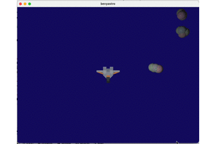
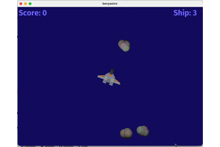

# rust-bevyastro

A game with rust(https://www.rust-lang.org) and the bevy framework(https://bevyengine.org). 

Inspired by class space games
    
Thanks to Kenney https://www.kenney.nl for the assets.

## 1. Step _ moving ship

<br><br><br><br><br><br><br><br>

## 2. Step _ moving asteriods

<br><br><br><br><br><br><br><br>

## 3. Step _ moving laser

<br><br><br><br><br><br><br><br>

## 4. Step _ colliding laser with asteroid

<br><br><br><br><br><br><br><br>


```Rust

```
